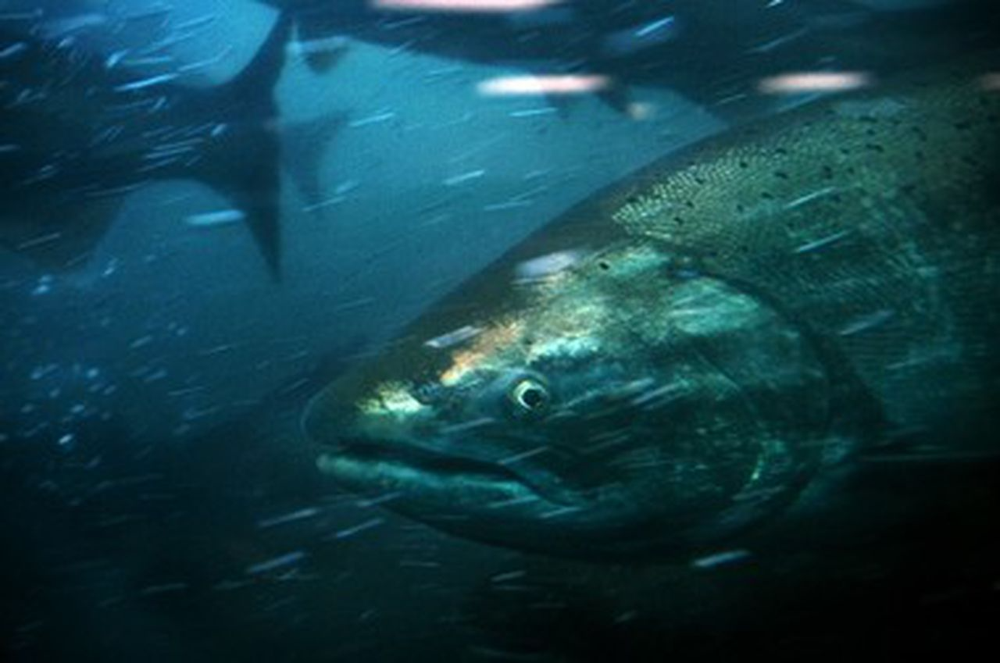

```{r setup, include=FALSE, warning = FALSE, message = FALSE}
knitr::opts_chunk$set(echo = TRUE, warning = FALSE, message = FALSE)
library(sf)
library(tidyverse)
library(here)
library(png)
library(broom)
library(tsibble)
library(feasts)
library(fable)
library(janitor)
library(lubridate)
library(patchwork)
library(scales)
```

#### **Overview**

This code examines Willamette Falls fish passage data collected between 2001 and 2010 at the Willamette Falls fish ladder on the Willamette River in Oregon. Timeseries graphs were created for three economically and ecologically important species of fish: Steelhead, Coho, and Coho Jack. Analysis revealed strong seasonality in observations among all three species. See code for annotations.

```{r}
# Lets create a locator map! 
# Read in Oregon counties shape file using read_sf() 
map_sf <- read_sf(here("data", "willamette", "tl_2019_41_cousub", "tl_2019_41_cousub.shp")) 

# Filter the Oregon counties for Northwest Clackamas county (where Willamette Falls is located)
sf <- map_sf %>%
  filter(NAME == "Northwest Clackamas")

# Graph all Oregon counties first, then graph just NW Clackamas on top, filled in in red to show the location!
ggplot() +
  geom_sf(data = map_sf) +
  geom_sf(data = sf, fill = "red") +
  theme(legend.title = element_blank()) +
  theme_void() +
  labs(title = "Oregon")
```

[he Willamette Falls fish ladder is located in in Northern Clackamas County, Oregon (highlighted in red). Data for this graph was obtained through public US Census Bureau files at \<data.gov\>. See "Data" for full citation.



##  {.tabset}

### Original Time Series
Let's see what is going on with abundances of Steelhead, Coho, and Coho Jack over time. To do this we will need to make subsets for each species in timeseries format using `tsibble`

```{r, include = FALSE}
# Read in and wrangle data
fish <- read_csv(here("data", "willamette", "willamette_fish_passage.csv")) %>%
  clean_names() 
```

```{r}
# Create subset of only steelhead for timeseries graph
steelhead <- fish %>%
  select(steelhead, date) %>%
  mutate(date = mdy(date)) # convert date column to myd format

# Set na values to 0
steelhead[is.na(steelhead)] = 0

# Count total steelhead each month and convert to timeseries frame
steelhead_ts <- steelhead %>%
  mutate(date = yearmonth(date)) %>%
  group_by(date) %>%
  summarize(total_steelhead = sum(steelhead)) %>%
  as_tsibble(key = NULL, index = date)
  
# Create subset of only Coho timeseries graph
coho <- fish %>%
  select(coho, date) %>%
  mutate(date = mdy(date)) # convert date column to myd format

# Set na values to 0
coho[is.na(coho)] = 0

# Count total Coho each month and convert to timeseries frame
coho_ts <- coho%>%
  mutate(date = yearmonth(date)) %>%
  group_by(date) %>%
  summarize(total_coho = sum(coho)) %>%
  as_tsibble(key = NULL, index = date)

#  Create subset of only Coho Jack for timeseries graph
jack_coho <- fish %>%
  select(jack_coho, date) %>%
  mutate(date = mdy(date)) # convert date column to myd format

# Set na values to 0
jack_coho[is.na(jack_coho)] = 0

# Count total Coho Jack each month and convert to timeseries frame
jack_coho_ts <- jack_coho%>%
  mutate(date = yearmonth(date)) %>%
  group_by(date) %>%
  summarize(total_jack_coho = sum(jack_coho)) %>%
  as_tsibble(key = NULL, index = date)

### This step is not necessary, but it makes it easier to graph in the next step
# Merge all totals together into one timeseries dataframe
fish_totals_ts <- merge(steelhead_ts, coho_ts, by = "date") %>%
  merge(jack_coho_ts, by = "date") %>%
  as_tsibble(key = NULL, index = date)
```

```{r}
# Create a basic exploratory plot to see overall abundance trends
ggplot(data = fish_totals_ts) +
  geom_line(aes(x = date, y = total_steelhead, color = "Steelhead")) +
  geom_line(aes(x = date, y = total_coho, color = "Coho")) +
  geom_line(aes(x = date, y = total_jack_coho, color = "Coho Jack")) +
  theme_minimal() +
  labs(y = "Fish Counts", x = "Time",
       color = "Species")
```

**Figure 1.** Red, blue, and green lines represent monthly fish counts for Coho, Steelhead, and Coho Jack, respectively.

Trends:

-   We see that there is strong seaonal patterns in species counts among all three fish

-   Steelhead appear to be declining

-   Coho appear to be increasing

-   Coho Jack are consistently the least abundant

### Seasonplots
We notice from the overall timeseries plots that appears to be some sort of seasonality in fish abundance for each species. Let's take a closer look by creating individual seasonality plots!

```{r}
# Create seasonality plot for Steelhead, store this graph as a value as we will combine all three fish species graphs into one using patchwork later on.
g1 <- fish_totals_ts %>%
  gg_season(y = total_steelhead) +
  labs(y = "Steelhead") +
  theme_minimal() +
  theme(panel.grid.major = element_blank()) +
  theme(axis.title.x = element_blank()) 

# Create seasonality plot for Coho
g2 <- fish_totals_ts %>%
  gg_season(y = total_coho) +
  labs(y = "Coho") +
  theme_minimal() +
  theme(panel.grid.major = element_blank()) +
  theme(axis.title.x = element_blank()) 

# Create seasonality plot for Coho Jack
g3 <- fish_totals_ts %>%
  gg_season(total_jack_coho) +
  theme(axis.title.x = element_blank()) +
  theme_minimal() +
  theme(panel.grid.major = element_blank()) +
  labs(y = "Coho Jack", x = "Month") 

# Bind plots together into one figure using patchwork
(g1 / g2 / g3) + 
  plot_layout(guides = "collect") # Group legends together into one
```

**Figure 2.** Seasonality analysis: Different colored lines represent each year that data was collected

Trends:

-   Steelhead populations are decreasing - Coho populations are much higher in 2009 and 2010 than any other measurements before

-   Coho and Coho Jack populations both peak for \~ 3 months between August and November

-   Steelhead populations peak every 6 months, between February and July

### Annual Counts by Species
We know that there is definitely some seasonality in each species relative abundance, but we also think that there might be an overall increase or decrease in some of the species over time. To investigate this, let's look at total annual counts over time.

```{r}
# Create a subset of annual Steelhead count 
annual_steelhead <- merge(steelhead_ts, coho_ts, by = "date") %>%
  merge(jack_coho_ts, by = "date") %>%
  mutate(year = year(date)) %>%
  group_by(year) %>%
  summarize(annual_steelhead = sum(total_steelhead))

# Create a subset of annual Coho count
annual_coho <- merge(steelhead_ts, coho_ts, by = "date") %>%
  merge(jack_coho_ts, by = "date") %>%
  mutate(year = year(date)) %>%
  group_by(year) %>%
  summarize(annual_scoho = sum(total_coho))

# Create a subset of annual Coho Jack count
annual_jack_coho <- merge(steelhead_ts, coho_ts, by = "date") %>%
  merge(jack_coho_ts, by = "date") %>%
  mutate(year = year(date)) %>%
  group_by(year) %>%
  summarize(annual_jack_coho = sum(total_jack_coho))

# Merge all subsets together into one. This step is not necessary, but makes graphing simpler later on
total_annual <- merge(annual_steelhead, annual_coho, by = "year") %>%
  merge(annual_jack_coho, by = "year")
```

```{r}
# Create graph showing annual counts of Steelhead, Coho, and Coho Jack
ggplot(data = total_annual) +
  geom_line(aes(x = year, y = annual_steelhead, color = "Steelhead")) +
  geom_line(aes(x = year, y = annual_scoho, color = "Coho")) +
  geom_line(aes(x = year, y = annual_jack_coho, color = "Coho Jack")) +
  scale_x_continuous(breaks = pretty_breaks(10)) +
  theme_minimal() +
  theme(panel.grid.major = element_blank()) + 
  labs(y = "Total Species Counts", x = "Year",
       color = "Species") 
```

**Figure 3.** Total species counts per year for Coho, Coho Jack, and Steelhead. Red, green, and blue lines reperesent fish species, respectively.

Trends:

-   Steelhead appear to be declining

-   Coho appear to be increasing

-   Coho Jack have maintained relatively steady, low abundance

## Data Citations:

Columbia Basin Research: DART Adult Passage Counts. Accessed 04 March 2022. <http://www.cbr.washington.edu/dart/query/adult_graph_text>

US Census Bureau. TIGER/Line Shapefile, 2019, state, Oregon, Current County Subdivision State-based <https://catalog.data.gov/dataset/tiger-line-shapefile-2019-state-oregon-current-county-subdivision-state-based>
