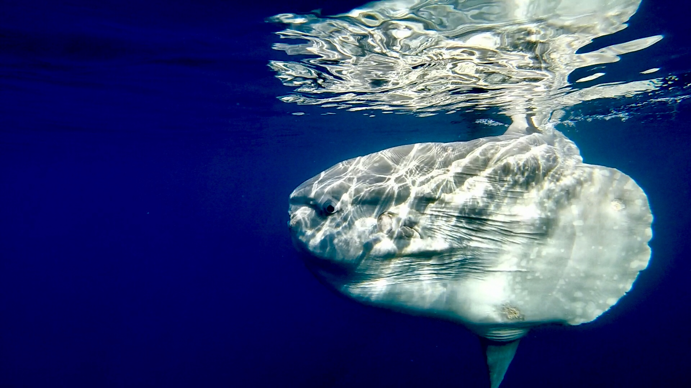
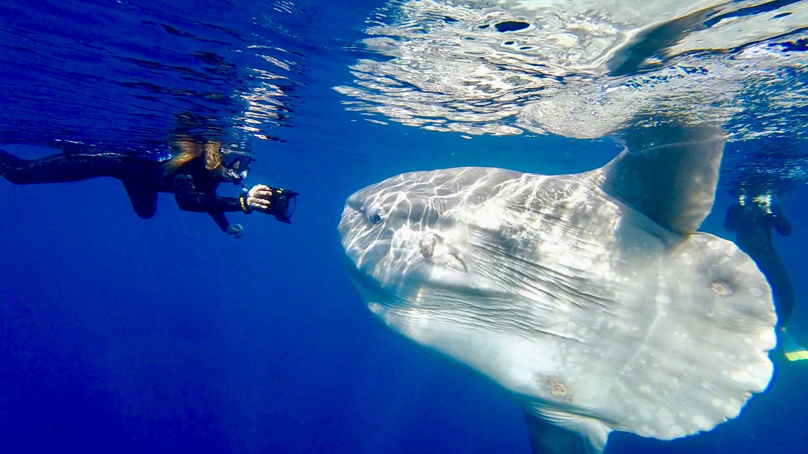
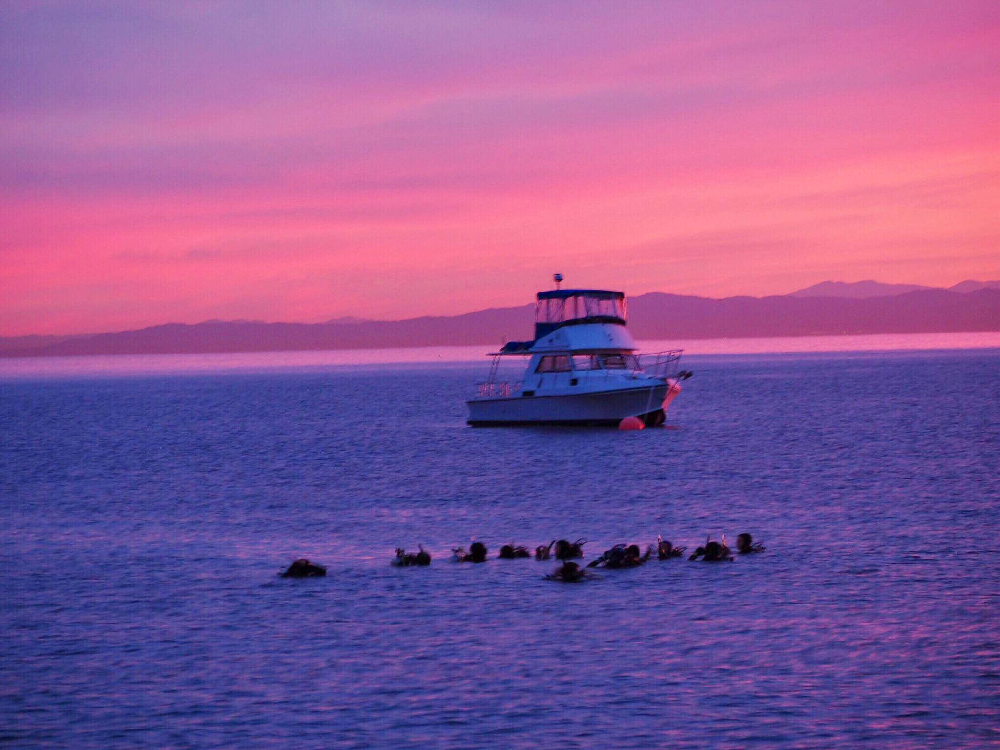
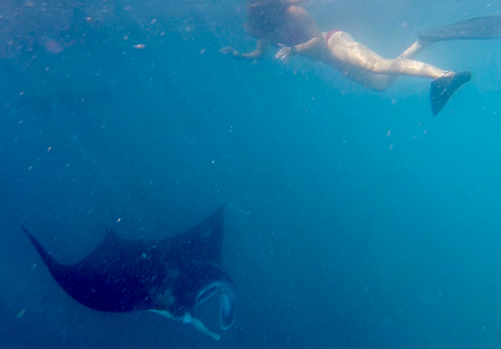
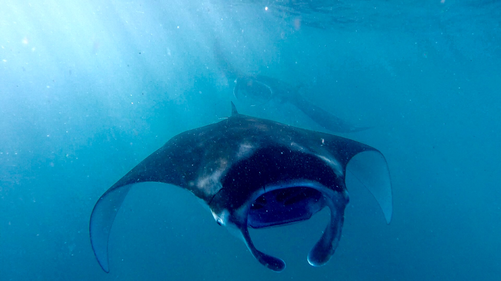
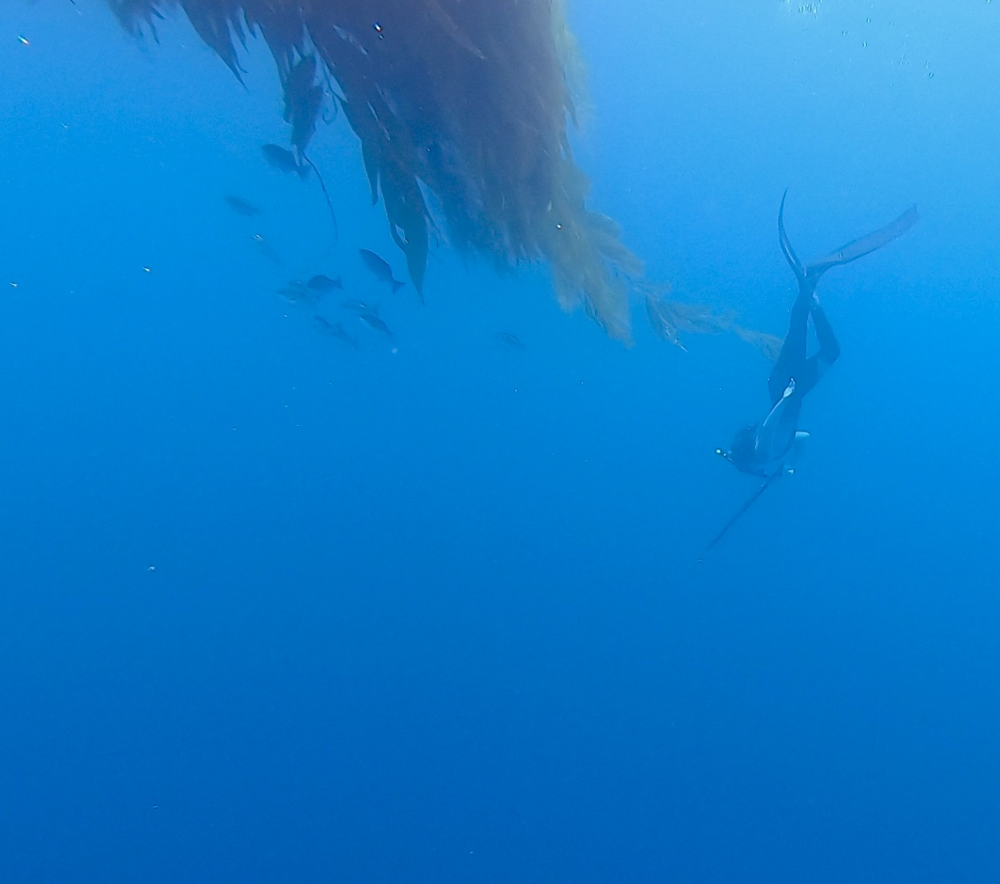

```{r setup, include=FALSE}
knitr::opts_chunk$set(echo = FALSE)
```

When I'm not in school or working I love to be outside surfing, freediving, skiing, hiking, and traveling. Check out some pictures of my latest adventures below!

, 

*Swimming with a massive mola in the Santa Barbara Channel*


*Being a cactus in Baja*


*One of many oceanfront campsites in Baja*


*Sunrise dive on Catalina Island*


*Hiking the crater at Mt. Bromo in Java, Indonesia*


*Beach goats!*


*My dog Ziggy*



*Swimming with giant mantas*


*A bison on the backside of Catalina Island*


*Hunting for some fish*


*A momma monkey and her baby*


*Rainbow town of Malang*


